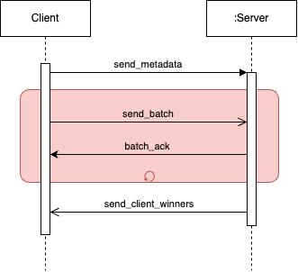

# TP0: Docker + Comunicaciones + Concurrencia

En el presente repositorio se provve una solución a la problemática de comunicación entre un servidor central y múltiples clientes que simulan agencias de lotería enviando batchs de apuestas. A continuación se detalla se realiza la ejecucion de cada ejercicio.

## Ejecutar servidor y clientes

Arrancar los contenedores con el servidor y los clientes de la siguiente manera:

```bash
make docker-compose-up
```

Para detener los contenedores:

```bash
make docker-compose-down
```

## Ejercicio 1:

Para probar el ejercicio 1, se debe correr el siguiente comando:

```bash
./generar-compose.sh docker-compose-dev.yaml <numero_de_clientes>
```

El resultado de este comando será la generación de un archivo `docker-compose.yaml` con la cantidad de clientes especificada.

## Ejercicio 2:

Este se prueba ejecutando el servidor y validando de alguna manera que los archivos de configuracion persistan correctamente.

## Ejercicio 3:

Para validar el correcto funcionamiento del servidor ejecutar el siguiente comando:

```bash
./validar-echo-server.sh
```

## Ejercicio 4, 5, 6, 7 y 8:

Para probar los ejercicios 4, 5, 6, 7 y 8, solo se tiene que validar que el servidor y los clientes se ejecuten correctamente.

```bash
make docker-compose-up
```

# Protocolo de Comunicación para Lotería Nacional

Este protocolo maneja la interacción entre un servidor central (en Python) y múltiples clientes (en Go) que simulan agencias de lotería enviando batchs de apuestas. A continuación se detalla cómo se lleva a cabo el envío, recepción y procesamiento de los mensajes entre las agencias y el servidor.



## Estructura del Mensaje

### Cliente (Agencias de Quiniela)

El cliente envía las apuestas utilizando la clase `GamblerProtocol` y `Gambler` en Go, que gestiona los datos:

1. **HouseID**: ID de la agencia que envía las apuestas (1 byte).
1. **Nombre del Jugador**: Nombre del apostador (hasta 30 bytes).
1. **Apellido del Jugador**: Apellido del apostador (hasta 30 bytes).
1. **DNI del Jugador**: Número de DNI del apostador (4 bytes).
1. **Fecha de Nacimiento**: Fecha de nacimiento del apostador (10 bytes).
1. **Número de Apuesta**: Número apostado (4 bytes).

Cada apuesta enviada tiene un tamaño fijo de **79 bytes**. Un batch puede tener hasta **8137 bytes** (equivalente a 103 apuestas) para garantizar una comunicación eficiente.

### Mensaje de Finalización

El batch enviado por el cliente finaliza con un mensaje especial llamado `END_MESSAGE` que tiene el mismo tamaño que una apuesta (79 bytes) y se utiliza para indicar el fin del batch.

### Acknowledgement

Por cada batch recibido el servidor responde con una batch de aknowledges confirmando la recepcion de las apuestas recibidas. Cada mensaje de confirmación tiene un tamaño de **9 bytes**, e incluye:

1. **DNI**: Número de DNI del apostador (4 bytes).
2. **Número de Apuesta**: Número de la apuesta (4 bytes).
3. **Código de Estado**: Código que indica si la apuesta fue almacenada exitosamente (1 byte).

El batch de confirmaciones finaliza con el mensaje `END`, de **9 bytes**.

## Servidor (Central de Lotería)

El servidor recibe los batch de apuestas, los deserializa y almacena en un archivo CSV haciendo uso de la clase `GamblerProtocol`, `Lottery` y `Gambler`. El protocolo del servidor sigue estos pasos:

1. **Recepción del Batch**:
   El servidor utiliza la metodo `receieve_batch_packets` para recibir las apuestas del cliente. El batch se procesa hasta que se detecta el mensaje `END_MESSAGE`, que marca el fin de las apuestas.

2. **Almacenamiento de Apuestas**:
   Una vez recibidos los datos, el servidor deserializa las apuestas mediante el metodo `deserialize_packets` y luego las almacena en un archivo usando `store_bets`.

3. **Envío de Confirmaciones**:
   Después de almacenar las apuestas, el servidor envía una confirmación al cliente con el metodo `send_packets_ack`.

4. **Cálculo de Ganadores**:
   Después de procesar todas las apuestas, el servidor utiliza la metodo `load_lottery_winners` para cargar los resultados y determinar los ganadores. Cada cliente recibirá una lista de los ganadores correspondiente a las apuestas de su agencia.

### Mensaje de Ganadores

Cuando se completa la evaluación de las apuestas, el servidor envía un mensaje que incluye la lista de documentos ganadores a través de la función `serialize_client_winners`. Este mensaje tiene la siguiente estructura:

1. **Longitud del Mensaje**: El servidor primero envía 2 bytes que indican la longitud total del mensaje.
2. **Documentos Ganadores**: Luego, se envían los números de DNI ganadores, cada uno de 4 bytes.

# Mecanismos de Sincronización Utilizados

## 1. Barrier (`multiprocessing.Barrier`)

- **Ubicación:** `server.py` en la función `run()` y `__handle_client_connection()`.
- **Descripción:**
  - Se utiliza una barrera para sincronizar a los clientes que se conectan al servidor.
  - La barrera asegura que todos los procesos de los clientes (definidos como procesos separados) esperen a que todos los demás hayan llegado a un punto específico (cuando todos los clientes han almacenado sus apuestas) antes de proceder.

## 2. Condition Variable (`multiprocessing.Condition`)

- **Ubicación:** `server.py` en la función `run()` y `__handle_client_connection()`.
- **Descripción:**
  - Se utiliza una condición para notificar a los clientes cuando la lotería ha finalizado y los ganadores han sido seleccionados.
  - Una vez que todos los procesos de los clientes han llegado a la barrera y la lotería se ha realizado, el servidor utiliza la condición para despertar a todos los procesos de los clientes y permitirles proceder con el envío de los resultados.

## 3. Locks (`multiprocessing.Lock`)

- **Ubicación:** `gambler_protocol.py` en las funciones `store_bets()` y `load_lottery_winners()`.
- **Descripción:**
  - Se utiliza un (`Lock`) para asegurar que las operaciones de almacenamiento y carga de apuestas en el archivo CSV no sean interrumpidas por otros procesos.

## 4. Eventos (`threading.Event`)

- **Ubicación:** `server.py` en la clase `Server`.
- **Descripción:**
  - Se utiliza un evento para gestionar el gracefull shutdowns del servidor.
  - Cuando se recibe una señal de terminación (`SIGTERM`), el evento se establece, lo que permite al servidor cerrar las conexiones de manera ordenada.
